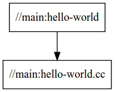

# Learn Bazel

- [Learn Bazel](#learn-bazel)
  - [官网教程](#官网教程)
  - [overview](#overview)
  - [安装bazel](#安装bazel)
  - [概念和术语](#概念和术语)
  - [构建一个C++项目](#构建一个c项目)
  - [使用 labels 引用 targets](#使用-labels-引用-targets)
  - [常用的C++ build 使用例子](#常用的c-build-使用例子)
  - [外部依赖](#外部依赖)
  - [规则](#规则)

## 官网教程

地址：<https://docs.bazel.build/versions/main/bazel-overview.html>

## overview

好处

- 支持多平台
- 可扩展

## 安装bazel

使用binary file 下载比较方便，可以使用镜像。镜像地址：https://mirrors.huaweicloud.com/bazel/5.2.0/

下载文件， bazel-5.2.0-installer-linux-x86_64.sh

1. 依赖

    ```linux
    sudo apt install g++ unzip zip

    # Ubuntu 18.04 (LTS) uses OpenJDK 11 by default:
    sudo apt-get install openjdk-11-jdk
    ```

2. 运行安装包

    ```linux
    chmod +x bazel-<version>-installer-linux-x86_64.sh
    ./bazel-<version>-installer-linux-x86_64.sh --user
    ```

3. 添加到ENV

    ```linux
    export PATH="$PATH:$HOME/bin"
    ```

可以参考，https://zhuanlan.zhihu.com/p/356312298

## 概念和术语

**Workspace**

包含 build 软件的源文件 存放的目录，有 `WORKSPACE` text file, 可空，可包含外部依赖

包含`WORKSPACE`文件的目录是根目录

**Repositories**

代码组织在 repositories。 `WORKSPACE` 所在的目录是 main repository， 也可以叫做 @ 。

**Packages**

库中代码主要组成单元。 相关的代码和相应的依赖。

目录包含有 `BUILD` 文件的。

以下结构，有两个 packages, `my/app`; 子 package `my/app/tests`。

```text
src/my/app/BUILD
src/my/app/app.cc
src/my/app/data/input.txt
src/my/app/tests/BUILD
src/my/app/tests/test.cc
```

**Targets**

一个package是一个容器。 package 的元素叫做 targets。 

一般是两种：

1. *files*
2. *rules*

**Labels**

taget的名字叫做label

Lexical specification of a label

**Rules**

## 构建一个C++项目

下载教程例子， `git clone https://github.com/bazelbuild/examples`

C++ tutorial目录结构

```text
examples
└── cpp-tutorial
    ├──stage1
    │  ├── main
    │  │   ├── BUILD
    │  │   └── hello-world.cc
    │  └── WORKSPACE
    ├──stage2
    │  ├── main
    │  │   ├── BUILD
    │  │   ├── hello-world.cc
    │  │   ├── hello-greet.cc
    │  │   └── hello-greet.h
    │  └── WORKSPACE
    └──stage3
       ├── main
       │   ├── BUILD
       │   ├── hello-world.cc
       │   ├── hello-greet.cc
       │   └── hello-greet.h
       ├── lib
       │   ├── BUILD
       │   ├── hello-time.cc
       │   └── hello-time.h
       └── WORKSPACE
```

有 `WORKSPACE` 文件的目录是 `workspace`，有 `BUILD` 文件的目录是`package`

**BUILD 文件**

```text
load("@rules_cc//cc:defs.bzl", "cc_binary")

cc_binary(
    name = "hello-world",
    srcs = ["hello-world.cc"],
)
```

`hello-world` target 实例化了 内置 `cc_binary` rule( 不需要任何依赖)

**Build 项目**

进入到 `stage1` workspace， build

```
bazel build //main:hello-world
```

build 完成后，运行 可执行文件

```text
bazel-bin/main/hello-world
```

**回顾依赖图**

展示依赖图

```text
bazel query --notool_deps --noimplicit_deps "deps(//main:hello-world)" --output graph
```

可视化

```text
sudo apt update && sudo apt install graphviz xdot

xdot <(bazel query --notool_deps --noimplicit_deps "deps(//main:hello-world)" \
  --output graph)
```



**改善 Bazel build**

增量build 多一个项目的多个部分

看 `stage2` 的例子

```text
load("@rules_cc//cc:defs.bzl", "cc_binary", "cc_library")

cc_library(
    name = "hello-greet",
    srcs = ["hello-greet.cc"],
    hdrs = ["hello-greet.h"],
)

cc_binary(
    name = "hello-world",
    srcs = ["hello-world.cc"],
    deps = [
        ":hello-greet",
    ],
)
```

首先 用内置的 `cc_library` rule build `hello-greet` library。
然后 是 `hello-world` 二进制文件
`deps` 指明依赖的文件

build

```text
bazel build //main:hello-world
```

可视化

```text
xdot <(bazel query --notool_deps --noimplicit_deps "deps(//main:hello-world)" \
  --output graph)
```


**使用多packages**

stage3 目录结构

```text
└──stage3
   ├── main
   │   ├── BUILD
   │   ├── hello-world.cc
   │   ├── hello-greet.cc
   │   └── hello-greet.h
   ├── lib
   │   ├── BUILD
   │   ├── hello-time.cc
   │   └── hello-time.h
   └── WORKSPACE
```

lib/BUILD

```text
cc_library(
    name = "hello-time",
    srcs = ["hello-time.cc"],
    hdrs = ["hello-time.h"],
    visibility = ["//main:__pkg__"],
)
```

main/BUILD

```
cc_library(
    name = "hello-greet",
    srcs = ["hello-greet.cc"],
    hdrs = ["hello-greet.h"],
)

cc_binary(
    name = "hello-world",
    srcs = ["hello-world.cc"],
    deps = [
        ":hello-greet",
        "//lib:hello-time",
    ],
)
```

build

```text
bazel build main:hello-world
```

run

```text
examples/cpp-tutorial/stage3/bazel-bin/main/hello-world
```

可视化

```text
xdot <(bazel query --notool_deps --noimplicit_deps "deps(//main:hello-world)" \
  --output graph)
```


## 使用 labels 引用 targets

`//path/to/package:target-name`

`//path/to/package`: 从 workspace 到 含有 BUILD 的路径

`target-name`: 在BUILD中 用name属性 命名的 名字

在根目录中，可以 `//:target-name`
在同 BUILD 文件中， 可以 省略 `//`

## 常用的C++ build 使用例子

**包含多个文件在一个target中**

```bazel
cc_library(
    name = "build-all-the-files",
    srcs = glob(["*.cc"]),
    hdrs = glob(["*.h"]),
)
```

**使用传递包含**

```bazel
cc_library(
    name = "sandwich",
    srcs = ["sandwich.cc"],
    hdrs = ["sandwich.h"],
    deps = [":bread"],
)

cc_library(
    name = "bread",
    srcs = ["bread.cc"],
    hdrs = ["bread.h"],
    deps = [":flour"],
)

cc_library(
    name = "flour",
    srcs = ["flour.cc"],
    hdrs = ["flour.h"],
)
```

**添加包含路径**

假设以下目录

```text
└── my-project
    ├── legacy
    │   └── some_lib
    │       ├── BUILD
    │       ├── include
    │       │   └── some_lib.h
    │       └── some_lib.cc
    └── WORKSPACE
```

`some_lib` 需要包含 `some_lib.h`. 那么 `legacy/some_lib/BUILD` 将需要指定 `some_lib/include` 目录是一个 包含目录。

如下：

```text
cc_library(
    name = "some_lib",
    srcs = ["some_lib.cc"],
    hdrs = ["include/some_lib.h"],
    copts = ["-Ilegacy/some_lib/include"],
)
```

**包含额外的libraries**

假设需要使用 Google test, 可以使用 一个repository functions在 workspace中去下载它，并在自己的repository中使用。

```text
load("@bazel_tools//tools/build_defs/repo:http.bzl", "http_archive")

http_archive(
    name = "gtest",
    url = "https://github.com/google/googletest/archive/release-1.10.0.zip",
    sha256 = "94c634d499558a76fa649edb13721dce6e98fb1e7018dfaeba3cd7a083945e91",
    build_file = "@//:gtest.BUILD",
)
```

然后创建 `gtest.BUILD` 用来编译 google test, 并遵守一些特殊的规则

- googletest-release-1.10.0/src/gtest-all.cc #include 所有其他的文件在 googletest-release-1.10.0/src/： 需要被 剔除以保证没有重复符号
- 它使用的头文件是跟 googletest-release-1.10.0/include/ directory ("gtest/gtest.h") 相关的。 所以你必须增加 需要包含的目录
- 需要link `pthread`, 所以需要 添加为 一个 `linkopt`

最终的规则如下：

```
cc_library(
    name = "main",
    srcs = glob(
        ["googletest-release-1.10.0/src/*.cc"],
        exclude = ["googletest-release-1.10.0/src/gtest-all.cc"]
    ),
    hdrs = glob([
        "googletest-release-1.10.0/include/**/*.h",
        "googletest-release-1.10.0/src/*.h"
    ]),
    copts = [
        "-Iexternal/gtest/googletest-release-1.10.0/include",
        "-Iexternal/gtest/googletest-release-1.10.0"
    ],
    linkopts = ["-pthread"],
    visibility = ["//visibility:public"],
)
```

看起来非常混乱，我们可以使用 `strip_prefix` 属性简化

```text
load("@bazel_tools//tools/build_defs/repo:http.bzl", "http_archive")

http_archive(
    name = "gtest",
    url = "https://github.com/google/googletest/archive/release-1.10.0.zip",
    sha256 = "94c634d499558a76fa649edb13721dce6e98fb1e7018dfaeba3cd7a083945e91",
    build_file = "@//:gtest.BUILD",
    strip_prefix = "googletest-release-1.10.0",
)
```

gtest.BUILD 将是这样

```text
cc_library(
    name = "main",
    srcs = glob(
        ["src/*.cc"],
        exclude = ["src/gtest-all.cc"]
    ),
    hdrs = glob([
        "include/**/*.h",
        "src/*.h"
    ]),
    copts = ["-Iexternal/gtest/include"],
    linkopts = ["-pthread"],
    visibility = ["//visibility:public"],
)
```

Now cc_ rules can depend on @gtest//:main.

## 外部依赖

Todo

## 规则

Todo